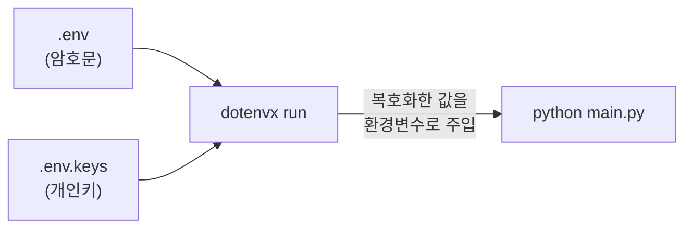
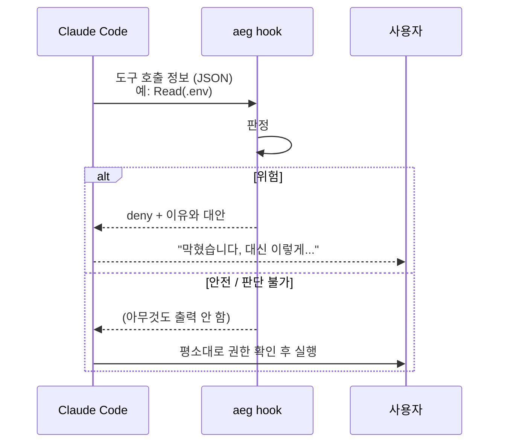

# AgentEnvGuard 쉽게 이해하기

> 명령 이름은 `aeg` 입니다.

---

## 1. 이게 뭔가요?

**Claude Code 같은 AI 코딩 에이전트가 내 API 키·비밀번호(시크릿)를 실수로
읽어버리지 않게 막아주는 안전장치**입니다.

비유하자면:

- [**dotenvx**](https://dotenvx.com) 는 금고입니다. 시크릿을 암호화해서 보관하고,
프로그램을 실행할 때만 꺼내 줍니다.
- **AgentEnvGuard(aeg)** 는 금고 앞의 경비원입니다. AI 가 금고 열쇠를 집거나
금고 안을 들여다보려고 하면 막고, "이렇게 하세요" 하고 올바른 방법을 알려줍니다.

aeg 자체는 시크릿을 저장하거나 암호화하지 않습니다. 그건 전부 dotenvx 가 합니다.

---

## 2. 왜 만들었나요?

AI 에이전트에게 "환경변수 설정 좀 확인해줘" 라고 하면, 에이전트는 아무렇지 않게
이런 명령을 실행합니다.

```bash
cat .env
```

그 순간 벌어지는 일:

1. `.env` 안의 API 키가 **대화 기록에 그대로 남습니다.**
2. 그 대화 기록은 AI 서비스로 전송되고, 로그·세션 기록에 저장됩니다.
3. 그 뒤로 그 키가 어디로 흘러가는지 **내가 통제할 수 없습니다.**

악의가 없어도, 에이전트가 "도움을 주려고" 파일을 읽는 것만으로 사고가 납니다.
aeg 는 이런 **우발적 노출**을 막기 위해 만들었습니다.

---

## 3. 실제로 막히는 모습

aeg 를 설치하면, Claude Code 가 도구를 쓰기 **직전에** aeg 가 먼저 검사합니다.

### 예시 1 — 평문 `.env` 를 보라고 했을 때

```
나:      .env 파일 내용 좀 보여줘

Claude:  Read(.env)
         ⎿ PreToolUse 훅이 차단함:
           /Users/me/myapp/.env 는 아직 평문입니다. 읽으면 시크릿이 대화 컨텍스트에 남습니다.

             aeg init

           로 암호화한 뒤 다시 시도하세요. 암호화하면 이 파일은 그대로 읽을 수 있습니다.

Claude:  .env 가 암호화되지 않은 상태라 읽을 수 없게 막혀 있습니다.
         먼저 `aeg init` 으로 암호화하시겠어요?
```

### 예시 2 — 개인키 파일을 읽으려 할 때

```
Claude:  Bash(cat .env.keys)
         ⎿ PreToolUse 훅이 차단함:
           /Users/me/myapp/.env.keys 는 dotenvx 개인키 파일입니다. 읽으면 볼트 전체가 열립니다.

           값을 직접 볼 필요 없이 다음으로 실행하세요:
             dotenvx run -- <실행할 명령>
```

### 예시 3 — 환경변수를 통째로 출력하려 할 때

```
Claude:  Bash(dotenvx run -- printenv)
         ⎿ PreToolUse 훅이 차단함:
           dotenvx run 은 복호화한 평문 값을 그대로 주입합니다. 자식 명령이 printenv, env
           처럼 환경변수를 출력하면 시크릿이 대화 컨텍스트에 남습니다.
```

### 예시 4 — 막히지 않는 경우

```
Claude:  Read(.env)                       ← 이미 암호화된 .env 라면 통과
Claude:  Read(.env.example)               ← 예시 파일은 항상 통과
Claude:  Bash(dotenvx run -- python app.py)  ← 일반 실행은 통과
```

암호화된 `.env` 는 값이 `encrypted:...` 암호문이라 읽혀도 아무것도 새지 않습니다.

> 차단 메시지가 항상 **대안을 함께** 알려주는 이유: 그냥 "안 됨" 이라고만 하면
> 에이전트가 다른 방법으로 우회를 시도하기 때문입니다.

---

## 4. 어떻게 사용하나요?

### 4-1. 설치 (노트북당 한 번)

```bash
brew install dotenvx/brew/dotenvx
go install github.com/liger82/AgentEnvGuard/cmd/aeg@latest
aeg install
```

`aeg install` 은 `~/.claude/settings.json` 에 aeg 훅을 등록합니다.
원본은 `~/.claude/settings.json.aeg-backup` 에 백업됩니다.

### 4-2. 평문 `.env` 찾기

```bash
aeg scan               # 홈 디렉터리 전체
aeg scan ~/projects    # 범위를 좁혀서 (더 빠름)
```

암호화가 필요한 `.env` 목록을 보여줍니다.

### 4-3. 암호화하기

```bash
aeg init ~/projects/myapp
```

이 명령 하나로:

1. `.env` 의 값들을 **그 자리에서** 암호문으로 바꿉니다 (`dotenvx encrypt`).
2. 개인키 파일 `.env.keys` 가 새로 생기고, `.gitignore` 에 자동으로 추가됩니다.
3. 예전에 평문 `.env` 가 git 에 커밋된 적이 있으면 **경고**합니다.

#### 암호화 전후 비교

```bash
# 전: .env
OPENAI_API_KEY=sk-abc123
```

```bash
# 후: .env  (커밋해도 안전)
DOTENV_PUBLIC_KEY="03f8a1..."
OPENAI_API_KEY="encrypted:BG7x9k..."
```

```bash
# 새로 생김: .env.keys  (절대 커밋 금지)
DOTENV_PRIVATE_KEY="a4c2e9..."
```


| 무엇           | 어디에         | 커밋해도 되나?     |
| ------------ | ----------- | ------------ |
| 공개키 (잠그는 열쇠) | `.env` 맨 위  | ✅            |
| 암호화된 값       | `.env`      | ✅            |
| 개인키 (여는 열쇠)  | `.env.keys` | ❌ **절대 안 됨** |


- 공개키로는 **잠그기만** 할 수 있어서, 누가 봐도 괜찮습니다.
- 개인키가 있어야 **열 수** 있습니다. 그래서 지켜야 할 파일은 `.env.keys` 하나뿐입니다.
- 팀원에게는 `.env` 는 git 으로, `.env.keys` 는 비밀번호 관리자 같은 별도 경로로 전달하세요.

> ⚠️ 예전에 평문 `.env` 를 커밋한 적이 있다면, 암호화해도 git 기록에는 평문이
> 남아 있습니다. 그 키는 발급한 곳(OpenAI 콘솔 등)에서 **새로 발급**받으세요.

`.env.local`, `.env.production` 같은 파일은 `aeg init` 이 다루지 않습니다.
직접 암호화하세요.

```bash
dotenvx encrypt -f .env.production
```

### 4-4. 코드에서 암호화된 시크릿 쓰기

**코드는 바꿀 필요가 거의 없습니다.** 평소처럼 환경변수를 읽으면 됩니다.

```python
import os
api_key = os.environ["OPENAI_API_KEY"]
```

```js
const apiKey = process.env.OPENAI_API_KEY
```

**실행할 때 앞에 `dotenvx run --` 만 붙이세요.**

```bash
dotenvx run -- python main.py
dotenvx run -- node app.js
dotenvx run -- npm run dev
```

동작 원리:



값은 실행되는 프로그램의 메모리에만 들어가고, 디스크에 평문 파일이 다시 생기지 않습니다.

매번 치기 귀찮으면 `package.json` 에 넣어 두세요.

```json
"scripts": {
  "dev": "dotenvx run -- next dev"
}
```

#### 주의: 코드 안에서 `.env` 를 직접 읽고 있다면

`load_dotenv()` (Python) 나 `require('dotenv').config()` (Node) 를 쓰고 있다면:


| 상황                    | 결과                                                |
| --------------------- | ------------------------------------------------- |
| `dotenvx run` 으로 실행   | 대부분 정상 동작 (기본적으로 기존 값을 덮어쓰지 않음)                   |
| `dotenvx run` 없이 실행   | 값이 `"encrypted:..."` 문자열이 됨 → **에러 없이 인증만 실패** 😵 |
| `override=True` 옵션 사용 | `dotenvx run` 으로 실행해도 암호문이 덮어씀 → 실패               |


**권장: 이런 로딩 코드는 지우세요.**

Node 라면 대신 `@dotenvx/dotenvx` 를 쓰면 `dotenvx run` 없이도 코드 안에서 복호화됩니다.

```js
require('@dotenvx/dotenvx').config()
```

#### IDE 디버거 (VS Code, PyCharm)

실행 버튼은 `dotenvx run` 을 거치지 않습니다. 실행 설정의 명령을
`dotenvx run -- ...` 으로 감싸거나, 위의 `@dotenvx/dotenvx` 방식을 쓰세요.

### 4-5. 오탐이 날 때

막히면 안 되는 경로가 막히면 `~/.config/aeg/allow` 에 경로를 한 줄씩 적으세요.
그 경로 아래는 검사하지 않습니다.

```
# ~/.config/aeg/allow
/Users/me/projects/test-fixtures
```

---

## 5. 한계점

### 가장 중요한 한계: 작정하고 빼내는 건 못 막습니다

aeg 는 명령 **문자열**을 보고 판단합니다. 그래서 이런 식으로 돌려 쓰면 통과합니다.

```bash
d=dotenvx; $d get MY_KEY
```

셸 명령을 실행할 수 있는 에이전트에게서 값을 100% 숨기는 건 원리적으로 불가능합니다.
aeg 의 목표는 **실수로 새는 것을 막는 것**이지, 해킹을 막는 것이 아닙니다.

### 그 밖의 알려진 한계


| 막지 못하는 것                                      | 이유                                                        |
| --------------------------------------------- | --------------------------------------------------------- |
| 코드가 직접 값을 출력 (`print(os.environ["API_KEY"])`) | 실행 결과는 검사하지 않음. 디버그 출력을 남기지 마세요                           |
| 경로 없는 넓은 검색이 **평문** `.env` 의 줄을 보여줌           | 넓은 검색까지 막으면 에이전트가 코드 검색을 못 함. 해법은 `aeg init` 으로 평문을 없애는 것 |
| `DOTENV_PRIVATE_KE[Y]` 처럼 정규식으로 흐린 검색         | 의도적 우회에 해당                                                |
| `cd other && cat .env`                        | 명령 안의 `cd` 는 추적하지 않음                                      |
| `git show HEAD:.env`, `git diff .env`         | git 기록 읽기는 막지 않음                                          |
| `dotenvx run` 없이 실행한 `env`, `printenv`        | 시크릿이 주입되지 않은 셸이면 드러날 게 없고, 막으면 오탐이 너무 많음                  |
| git 기록에 이미 커밋된 평문                             | 암호화로 지워지지 않음. 키를 새로 발급받아야 함                               |


### 반대로, 과하게 막는 경우도 있습니다

- 명령에 `DOTENV_PRIVATE_KEY` 라는 **글자만 있어도** 막힙니다. 예를 들어
`unset DOTENV_PRIVATE_KEY` 나, 이 단어가 들어간 문서를 셸 명령으로 쓰는 것도
막힙니다. (이 문서를 만드는 도중에도 실제로 막혔습니다.)

---

## 6. 내부 동작 설명

### 6-1. 전체 흐름



Claude Code 는 `Bash`, `Read`, `Grep` 도구를 쓰기 직전에 aeg 를 호출합니다
(PreToolUse 훅). aeg 는 JSON 으로 받은 도구 이름과 인자를 보고 판정합니다.

### 6-2. 왜 `Grep` 까지 검사하나요?

`Grep` 은 파일을 "검색"하지만, 결과로 **매칭된 줄 내용**을 돌려줍니다.
`.env.keys` 에서 `DOTENV_PRIVATE_KEY` 를 검색하면 Bash 도 Read 도 안 쓰고
개인키가 그대로 나옵니다. 그래서 반드시 함께 검사합니다.

### 6-3. 파일 판정 규칙

먼저 **파일 이름**으로 분류하고, 필요할 때만 **내용**을 봅니다.


| 파일 이름                                          | 판정                       |
| ---------------------------------------------- | ------------------------ |
| `.env.keys`, `.env.keys.bak` 등                 | **항상 차단** (파일을 열어보지도 않음) |
| `.env.example`, `.env.template`, `.env.sample` | 항상 허용 (공개용 예시)           |
| `.env`, `.env.local`, `.env.production` 등      | 내용을 보고 결정 ↓              |
| 그 외                                            | 허용                       |


`.env` 계열의 내용 판정:

- `DOTENV_PUBLIC_KEY` 줄이 있고 **나머지 모든 값이** `encrypted:` 로 시작 → **암호화됨 → 허용**
- 값이 하나도 없음 → 허용
- 그 외 (값이 하나라도 평문) → **차단**

성능을 위해 파일 앞부분 64KB 까지만 읽습니다. 훅은 도구 호출마다 실행되기 때문입니다.

### 6-4. Bash 명령 판정 규칙

1. **위험한 dotenvx 명령**: `dotenvx get`, `decrypt`, `keypair` 는 차단합니다.
npx @dotenvx/dotenvx`,` pnpm exec`,` sudo` 뒤에 와도 찾아냅니다.
2. **환경변수 덤프**: `dotenvx run -- printenv`, `dotenvx run -- env` 는 차단합니다.
3. **개인키 출력**: 명령에 `DOTENV_PRIVATE_KEY` 가 있으면 차단합니다.
4. **파일 읽기 명령**: `cat`, `head`, `grep`, `sed`, `cp`, `base64`, `source`
 **내용을 드러내는 명령**의 인자와 `< 파일` 입력 리다이렉션을 모아
-3 의 파일 규칙으로 판정합니다.
  - `rm`, `ls`, `touch` 처럼 내용을 드러내지 않는 명령은 검사하지 않습니다.
  - `cat foo > .env` 처럼 **쓰기만** 하는 리다이렉션은 허용합니다.

명령 해석에서 신경 쓴 부분:

- `&&`, `||`, `;`, `|`, 줄바꿈으로 이어진 명령을 각각 따로 봅니다.
- `cat ".env.keys"`, `cat '.env.keys'`, 백슬래시 이스케이프를 bash 규칙대로 풀어서 봅니다.
- `sudo`, `env VAR=1`, `nohup` 같은 접두어 뒤의 실제 명령을 찾습니다.
- `~/`, `$HOME/` 경로를 홈 디렉터리로 펼쳐서 봅니다.

### 6-5. 안전하게 실패하도록 한 설계

aeg 가 고장 나서 **모든 작업이 막히는 것**도 사고입니다. 그래서:

- **판단할 수 없으면 통과시킵니다** (fail-open). 입력 파싱 실패, 내부 오류,
파일을 못 여는 경우 등.
  - 단, 입력을 해석하지 못해도 원본에 `.env.keys` 글자가 있으면 차단합니다.
- **허용할 때는 아무것도 출력하지 않습니다.** "허용(allow)" 이라고 적극적으로
답하면 Claude Code 가 권한 확인 창을 건너뛰어, `rm -rf` 같은 명령까지
자동 승인되기 때문입니다. aeg 는 **차단만** 하고, 나머지는 Claude Code 의
원래 권한 흐름에 맡깁니다.
- 종료 코드는 항상 0 입니다. 차단 여부는 출력 JSON 으로만 전달합니다.

### 6-6. `aeg install` 의 안전장치

- 이미 설치되어 있으면 아무것도 바꾸지 않습니다 (여러 번 실행해도 안전).
- 처음 바꿀 때만 원본을 백업하고, 이미 있는 백업은 덮어쓰지 않습니다.
- 임시 파일에 쓴 뒤 교체해서, 쓰는 도중 실패해도 설정 파일이 깨지지 않습니다.
- 설정 파일이 올바른 JSON 이 아니면 덮어쓰지 않고 멈춥니다.
- 되돌리기:
  ```bash
  cp ~/.claude/settings.json.aeg-backup ~/.claude/settings.json
  ```

### 6-7. `aeg scan` 이 건너뛰는 곳

- `node_modules`, `.git`, `vendor`, `dist`, `build`, `target`, `.venv`,
`venv`, `.cache`, `.Trash`, `Library`, Go 모듈 캐시(`go/pkg/mod`)
- 기본 탐색 깊이 6 (`--depth N` 으로 조절)
- Google Drive, Dropbox 같은 동기화 폴더는 느릴 수 있다고 경고합니다.
- `.env.keys` 는 `.gitignore` 에 **없을 때만** 보고합니다.

---

## 더 읽을거리

- [docs/dotenvx-guide.md](docs/dotenvx-guide.md) — `aeg init` 과 dotenvx 키 저장 방식 상세
- [docs/decisions-2026-09-13.md](docs/decisions-2026-09-13.md) — 개발 중 내린 결정과 그 이유
- [docs/investigation-2026-09-27.md](docs/investigation-2026-09-27.md) - dotenvx 의 OS 키체인 전환과 출력 리댁션 검토

